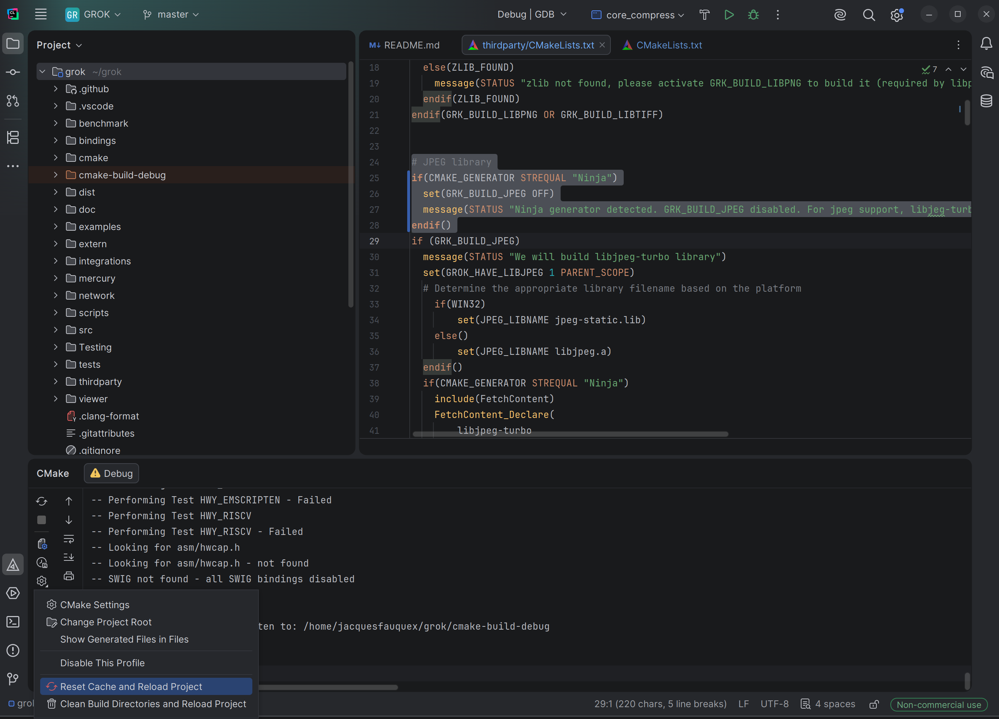

# dicmhtj2k
Compresses DICM explicit little endian to jpeg 2000 high throughput and writes the result to file.
Uses [grok](https://github.com/GrokImageCompression) to perform the compression. (rplc)

Before the compression, canonicalizes the DICM input in the following way:
- remove non-significant spaces in text attributes
- uses utf8 instead of any other charset
- adds sequence end tag instead of defined length sequence
- adds series end tag instead of defined length item
- appends a trailing padding tag with blake3 hash of the uncompressed pixels

## Compilation of grok in clion cmake ubuntu
- new project from svn... https://github.com/GrokImageCompression
- the third party turbojpeg is problematic in linux. 
This is an optional library for codification from or decodification to jpeg.
Out of scope for dicmhtj2k. Disable it:
   - CMakeLists.txt line 168 option(GRK_BUILD_JPEG "Build jpeg library" **OFF**)
   - or uncomment thirdParty/CMakeLists.txt line 24
````
# JPEG library
if(CMAKE_GENERATOR STREQUAL "Ninja")
  set(GRK_BUILD_JPEG OFF)
  message(STATUS "Ninja generator detected. GRK_BUILD_JPEG disabled. For jpeg support, libjeg-turbo can be independantly installed.")
endif()
````
and then recreate CMake config cache.


Note: a cargo project for rust integration is also available

## Integration of grok into dicmhtj2k
- uses the compiled libgrokj2k
- adapts GrkCompress.cpp


````
#include "grok_codec.h"
#include "grok.h"

int main(int argc, const char* argv[])
{
  int rc = grk_codec_compress(argc, argv, nullptr, nullptr);
  grk_deinitialize();
  return rc;
}
````
grk_deinitialize() useless if we do not use codecs.


````
int grk_codec_compress(int argc, const char* argv[], grk_image* in_image, grk_stream_params* stream)
{
  return grk::GrkCompress().main(argc, argv, in_image, stream);
}

````

To avoid to use codecs, and work from cpu only
````
 * GRK_NO_PLUGIN
 *   When set (to any value), grk_initialize() skips grk_plugin_load(). This
 *   forces the CPU codec for the whole process — useful for `make test` and
 *   any context that wants to bypass the GPU/accelerator plugin without
 *   changing call sites. Read once on first grk_initialize() call.
 
// Plugin loading is suppressed when the GRK_NO_PLUGIN environment variable is
// set (to any value). Cached on first read so the env is consulted once per
// process — useful for `make test` and similar contexts that want to force
// the CPU codec without changing call sites.
static bool grk_plugin_load_inhibited(void)
{
static const bool inhibited = std::getenv("GRK_NO_PLUGIN") != nullptr;
return inhibited;
}
````

## GrkCompress.cpp (linea 336) is where everything really start
int GrkCompress::main(int argc, const char** argv, grk_image* in_image, grk_stream_params* stream)

````
  GRK_LRCP = 0, /** layer-resolution-component-precinct order */
  GRK_RLCP = 1, /** resolution-layer-component-precinct order */
  GRK_RPCL = 2, /** resolution-precinct-component-layer order */
  GRK_PCRL = 3, /** precinct-component-resolution-layer order */
  GRK_CPRL = 4, /** component-precinct-resolution-layer order */
````