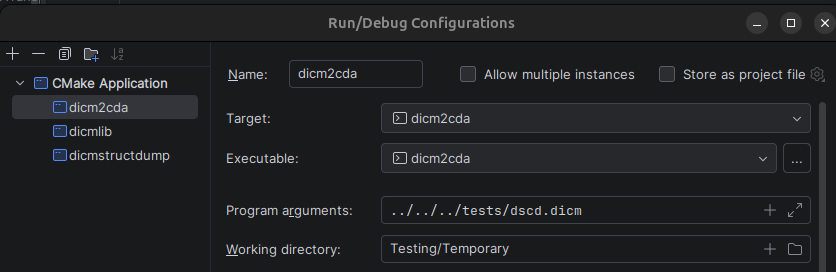
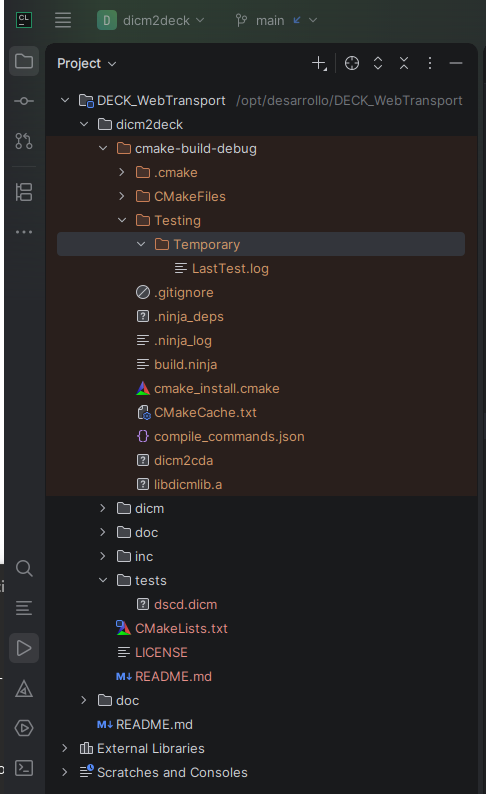

# cdicm2deck

Dicom Exam Contextualized Keys (DECK) is a flat hashmap parser result language 
for DICM files. The objective of this presentation of the DICOM metadata is
consumer lowest latency, which implies discrete acceses to any attribute. 

cdicm2deck, executable command written in C, 
parses DICM (DICOM standard part 10 file format),
outputting DECK key values representation. 

As input, it requires an explicit little endian representation
of the dataset terminated by an empty trailling padding attribute.
We call this presentation "canonicalized" (CDICM). 
An ".cdicm" extension may be append to such files.

## dcmtk storescp -> cdicm2deck

We modified dcmtk storescp to receive DICOM DIMSE communication 
and write the canonicalized presentation (with trailing padding attribute).
Moreover, dcmtk storescp can invoque an executable with parameters to post process each SOP instance.
We added the critical information of the DIMSE association as parameters to the invocation, 
in this case of a cdicm2deck executable.

The modified dcmtk storescp and cdicm2deck work as a binome.

## dicm2deck design

dicm2deck is layered.

Common to all products is the main file which:
- parses the dataset structure
- delegates reading and writing functions to a second layer "uapi" (u meaning uncategorized):
   - input (delegates the opening the canonicalized file)
   - key and val (delegates reading at attribute level)
   - trail (called when the trailling padding attribue has been reached)
   
### Third level capi
This class is not used by uapi executables.
capi is exposed by a specific implementation of uapi which delegates append functions depending on attribute category:
- eAppend for patient and study attributes
- sAppend for series attributes
- xAppend for special series attributes
- pAppend private attributes
- iAppend instance attributes
- fAppend float pixel 7FE00008 (not implemented)
- dAppend double pixel 7FE00009 (not implemented)
- bAppend byte pixel 7FE00010
- wAppend short pixel 7FE00010
- lAppend long pixel 7FE00010 (not implemented)
- vAppend very long pixel 7FE00010 (not implemented 64 bits)

Note: 
the DICOM explicit little endian syntax represents pixels in native format, 
that is, as a succession of pixel lines without any markup between them. 
This applies also to multiframe images where the first line of the next frame 
follows immediately the last line of the previous one.

### forth level capi sqlite implementation
The sqlite default implementation of capi (categorized api) builds up an instance sqlite with the attributes subdivided into categories.

## Testing environment
The folder Testing contains canonicalized test files. 
The modified storescp outputs DICOM datasets received as files into this directory.

dicm2deck may produce files as output. We configured CMake targets 

to write them into a folder automatically created by CLion (the IDE we use):
cmake-build-debug/Testing/Temporary 

### dicm2deck targets:

- uapi: **cdicm2cda** extracts the enclosed CDA from a DICM encapsulatedCDA SOP instance
- uapi: **dicmstructdump** dumps a textual representation of the DICM file.
- 
- uapi: **deepcopy** creates an explicit little endian copy by appending each attribute, one by one
- uapi: **cdicm2ile** transforms cdicm to explicit little endian
- uapi: **utf8dump** writes to utf-8 text console a list of contextual attributes
- uapi: **cdicm2xml**
- uapi: **cdicm2json**

- capi: **sqlite** keeps the parsing into an in-memory sqlite.
- capi: **examsqlite**

___

We use CMake® and JetBrain CLion® IDE for the development.

DICOM® is a Registered Mark under the copyright of 
"National Electrical Manufacturers Association" (USA) 
