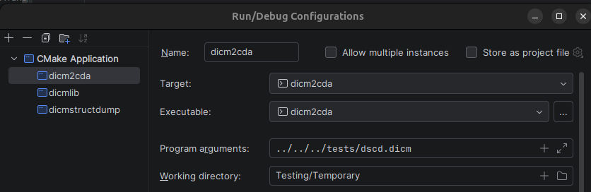
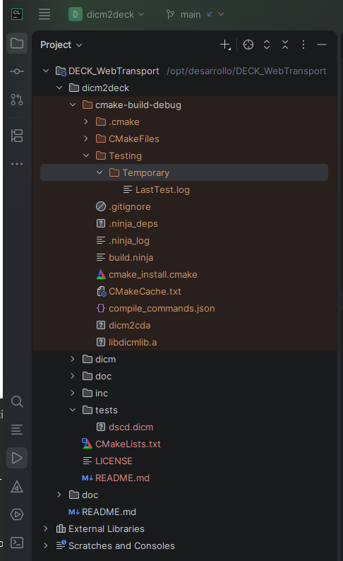

# dicm2deck

Dicom Exam Contextualized Keys (DECK) is a flat hashmap parser result language 
for DICM files. 

dicm2deck is a console command factory written in C. The executable produced all
use the parser outputting DECK key values. It implements a pipe architecture with 
DICM input streamed from stdin and the result streamed out to stdout.

dicm2deck comes with 2 apis:
* uapi (u meaning uncategorized) exposes DICOM attributes
* capi (c meaning categorized) exposes DICM attributes categorized as:
   - e patient and study attributes
   - s series attributes
   - p private attributes
   - i instance attributes
   - f float pixel 7FE00008 (not implemented)
   - d double pixel 7FE00009 (not implemented)
   - b byte pixel 7FE00010
   - w short pixel 7FE00010
   - l long pixel 7FE00010 (not implemented)
   - v very long pixel 7FE00010 (not implemented 64 bits)

Note 1: 
the DICOM explicit little endian syntax represents pixels in native format, 
that is as a succession of lines without any markup between them. 
This applies also to multiframe images where the first line of the next frames 
follows immediately the last line of the previous one.

Note 2: 
f,d,l,v are not implemented because we haven't ever seen any sample of them, 
and also because the compression htj2k which we apply to the output pixel 
supports byte and short pixels only.

### Testing environment

In the folder tests are found DICM test files.

When dicm2deck outputs a file, we configured CMake targets 

to write them into a folder automatically create by CLion IDE:
cmake-build-debug/Testing/Temporary 

Please modify CMake target configuration for your own use case.

### Examples of dicm2deck targets:

- uapi: **dicm2cda** extracts the enclosed CDA from a DICM. 
   - Example infile: dscd.dicm
- uapi: **dicmstructdump** dumps a textual representation of the DICM file. 
   - Example infile: dscd.dicm
- capi: **dicm2decksqlite** (not ready yet)

___

We use CMake® and JetBrain CLion® IDE for the development.

DICOM® is a Registered Mark under the copyright of 
"National Electrical Manufacturers Association" (USA) 
